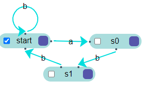

# Construção de Interpretadores - Máquinas de Estados Finitos

## Realizado
Aluno: Vinícius Marques da Silva de Oliveira <br>
Data: 10/08/2022

## Regras
alfabeto = {a ,b, c} <br>
linguagem = {x | x ∈ {a, b}*} e cada a seguido por bb

## Diagrama de Estados


## Como executa-lo
Se você ter acesso a um terminal
```bash
mkdir build
cmake -S ./ -B ./build -G "MinGW Makefiles"
cmake --build ./build/
.\build\FiniteStateMachine.exe
```

## Status
<h4 align="center"> 
	✔️ Finalizado ✔️
</h4>
